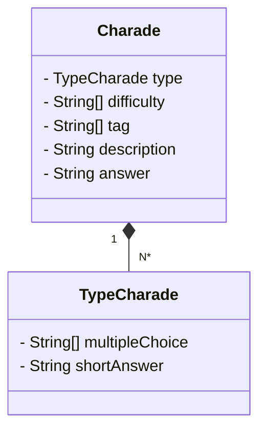

# 🃏 Charades Game RESTful API 

Welcome to the repository of the RESTful API for a Charades Game developed with Spring Boot in Java!

This API allows users to play charades, get random charades, add new charades, and much more. It's a great way to challenge your knowledge and have fun!

## Features

- 🎭 **Play Charades**: Test your knowledge by answering fun charades.
- 🎲 **Get Random Charades**: Receive random charades whenever you want.
- ➕ **Add New Charades**: Contribute to the game by adding your own charades.
- 📊 **Scoring**: Keep track of your score to see how well you're doing.

## Technologies Used

- ⚙️ **Spring Boot**: Java framework for creating Spring-based applications quickly and easily.
- 🛠️ **Maven**: Build automation tool used primarily for Java projects.
- 🌐 **RESTful**: Software architecture for distributed systems, where resources are defined as collections of objects with well-defined operations.
- ☕ **Java**: Widely-used programming language for enterprise and desktop application development.
- 📝 **Git**: Distributed version control system for tracking changes in files during software development.

## Class diagram 

