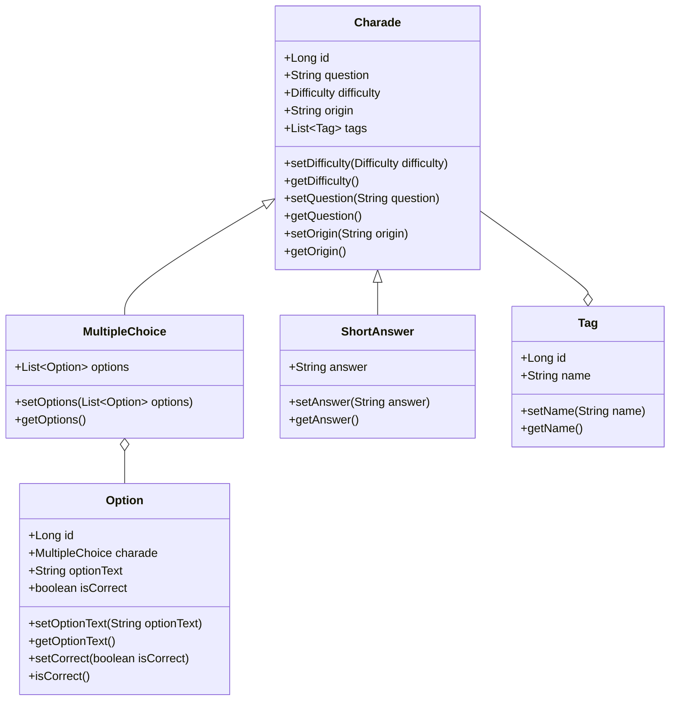

# charade-API-RESTful


## 🚀 Project Overview

The **charade-API-RESTful** is a Spring Boot-based API designed to provide a robust system for managing charades. These charades can be used in various other projects or applications, offering a rich and diverse set of riddles for users to interact with. The charades are classified by **difficulty levels** (EASY, MEDIUM, HARD) and **tags**, and can be either **multiple-choice** or **short-answer** formats. This project aims to be highly flexible and modular for integration with various applications.

## 🛠️ Features

- **Charade Types**: Multiple-choice and Short-answer charades.
- **Difficulty Levels**: Charades are categorized as **EASY**, **MEDIUM**, or **HARD** using enums.
- **Tags**: Charades can be tagged with various descriptors to enable filtering and categorization.
- **Reusable API**: Can be consumed by other projects or services.

## 🧠 Class Diagram




## 📋 API Endpoints

Here is a table summarizing the available API endpoints and their functionality:

| HTTP Method | Endpoint                        | Description                                 |
|-------------|---------------------------------|---------------------------------------------|
| **GET**     | `/charades`                     | Retrieves all charades                      |
| **GET**     | `/charades/{id}`                | Retrieves a specific charade by ID          |
| **GET**     | `/charades/tags/{tagName}`      | Retrieves charades filtered by tag          |
| **GET**     | `/charades/difficulty/{level}`  | Retrieves charades filtered by difficulty   |
| **GET**     | `/tags`                         | Retrieves all tags available in the database|


And these endpoints are only available for authorized users:

| HTTP Method | Endpoint                        | Description                                 |
|-------------|---------------------------------|---------------------------------------------|
| **POST**    | `/charades`                     | Creates a new charade                       |
| **POST**    | `/tags`                         | Creates a new tag                           |
| **PUT**     | `/charades/{id}`                | Updates an existing charade by ID           |
| **DELETE**  | `/charades/{id}`                | Deletes a specific charade by ID            |

## 📦 Installation

### Requirements

Before you begin, ensure you have met the following requirements:
- ✔️ **Java 17** installed
- ✔️ **Maven** installed

### Steps

1. Clone the repository:
   ```bash
   git clone https://github.com/yourusername/charade-API-RESTful.git

2. Navigate to the project directory:
   ```bash
   cd charade-API-RESTful

3. Build the project using Maven:
   ```bash
   mvn clean install
   ```

4. Run the application:
   ```bash
   mvn spring-boot:run
   ```
